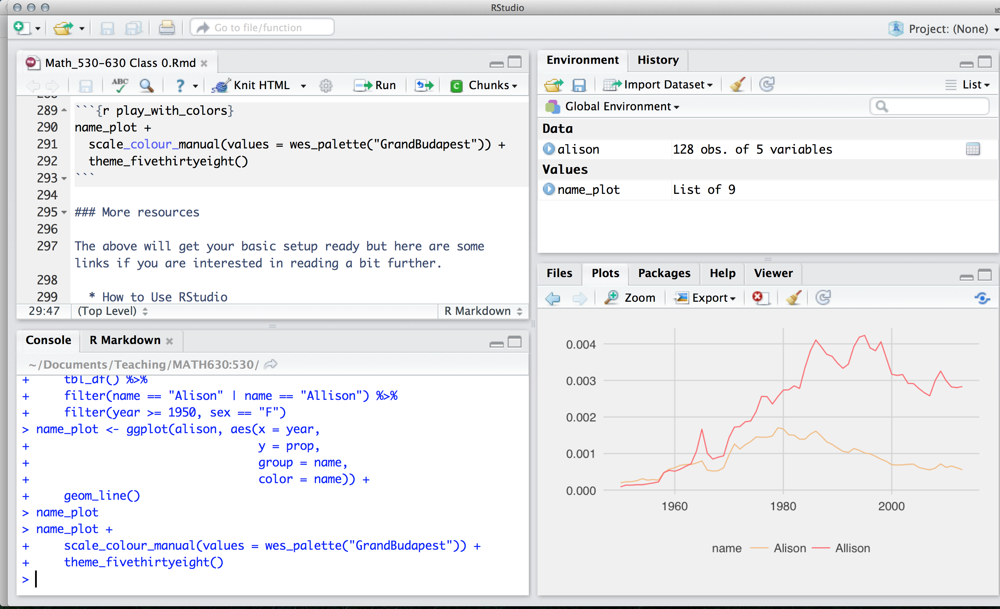

```{r setup, include = FALSE, cache = FALSE}
knitr::opts_chunk$set(error = TRUE, comment = NA, warnings = FALSE, errors = FALSE, messages = FALSE, tidy = FALSE)
```

```{r load-packages, include = FALSE}
library(tidyverse)
library(babynames)
```

> Read all the way through step 6, and note that there is a file that needs to be turned in to Sakai before Wednesday at noon!

# Overview

This guide will lead you through the steps to install and use [R, a free and open-source software environment for statistical computing and graphics.](https://www.r-project.org) 


What is R?

* **R** is the name of the programming language itself, based off of S from Bell Labs, which users access through a command-line interpreter (`>`)

What is RStudio?

* **RStudio** is a powerful and convenient user interface that allows you to access the R programming language along with a lot of other bells and whistles that enhance functionality (and sanity). 

Our end goal is to get you looking at a screen like this:



# Install R

Install R from [CRAN, the Comprehensive R Archive Network](https://cran.rstudio.com). Please choose a **precompiled binary distribution** for your operating system.

* If you need more help, check out one of the following videos (courtesy of Roger Peng at Johns Hopkins Biostatistics):
    - [Installing R on a mac](https://www.youtube.com/watch?v=Icawuhf0Yqo&feature=youtu.be)
    - [Installing R on windows](https://www.youtube.com/watch?v=mfGFv-iB724&feature=youtu.be)
* If you need even more help, read this [step-by-step guide](https://beckmw.files.wordpress.com/2014/09/r_install_guide.pdf), including screenshots.

## Check in

Launch R. You should see one console with a command line interpreter (`>`). Close R.

# Install RStudio 

Install the free, open-source edition of RStudio: http://www.rstudio.com/products/rstudio/download/

RStudio provides a powerful user interface for R, called an *integrated development environment*. RStudio includes:

* a console (the standard command line interface: `>`), 
* a syntax-highlighting editor that supports direct code execution, and 
* tools for plotting, history, debugging and workspace management.


## Check in

Launch RStudio. You should get a window similar to the screenshot you see [here](https://www.rstudio.com/wp-content/uploads/2014/04/rstudio-workbench.png), but yours will be empty. Look at the bottom left pane: this is the same console window you saw when you opened R in step 1.15. 

* Place your cursor where you see `>` and type `x <- 2 + 2`, hit enter or return, then type `x`, and hit enter/return again. 
* If `[1] 4` prints to the screen, you have successfully installed R and RStudio, and you can move onto installing packages.

# Install packages

The version of R that you just downloaded is considered base R, which provides you with good but basic statistical computing and graphics powers. For analytical and graphical super-powers, you'll need to install add-on packages, which are user-written, to extend/expand your R capabilities. Packages can live in one of two places:

* They may be carefully curated by CRAN (which involves a thorough submission and review process), and thus are easy install using `install.packages("name_of_package", dependencies = TRUE)`. 
* Alternatively, they may be available via GitHub. To download these packages, you first need to install the `devtools` package.

```{r devtools, eval = FALSE}
install.packages("devtools")
library(devtools)
install_github("name_of_package")
```

Place your cursor in the console again (where you last typed `x` and `[4]` printed on the screen). You can use the first method to install the following packages directly from CRAN, all of which we will use:

  * [`dplyr`,](http://dplyr.tidyverse.org)
  * [`ggplot2`,](http://ggplot2.tidyverse.org)
  * [`babynames`](https://github.com/hadley/babynames)

  
You can download all of these at once, too:
```{r c_install, eval = FALSE}
install.packages(c("dplyr", "ggplot2", "babynames"), 
                 dependencies = TRUE)
```

<p class="text-info"> __Heads up:__ We should formally introduce the combine command, [`c()`](http://stat.ethz.ch/R-manual/R-patched/library/base/html/c.html), used above. You will use this often- any time you want to combine things into a vector.</p>

```{r c_demo}
c("hello", "my", "name", "is", "alison")
c(1:3, 20, 50)
```

Mind your use of quotes carefully with packages.

* To *install* a package, you put the name of the package in quotes as in `install.packages("name_of_package")`. 
* To *use* an already installed package, you must load it first, as in `library(name_of_package)`, leaving the name of the package bare. You only need to do this once per RStudio session.
* If you want *help*, no quotes are needed: `help(name_of_package)` or `?name_of_package`.
* If you want the *citation* for a package (and you should give credit where credit is due), ask R as in `citation("name_of_package")`.

```{r show_dplyr, eval = F}
install.packages("dplyr", dependencies = TRUE)
library(dplyr)
help("dplyr")
```

```{r help_dplyr}
citation("ggplot2")
```


<p class="text-info"> __Heads up:__ R is **case-sensitive**, so `?dplyr` works but `?Dplyr` will not. Likewise, a variable called `A` is different from `a`.</p>

# Make a name plot

Open a new R script in RStudio by going to `File --> New File --> R Script`. For this first foray into R, I'll give you the code, so sit back and relax and feel free to copy and paste my code with some small tweaks.

First load the packages:

```{r show_name_packages, eval = F}
library(babynames) # contains the actual data
library(dplyr) # for manipulating data
library(ggplot2) # for plotting data
```


Next, we'll follow [best practices for inspecting a freshly read dataset](https://cran.r-project.org/doc/contrib/de_Jonge+van_der_Loo-Introduction_to_data_cleaning_with_R.pdf). Also, see ["What I do when I get a new data set as told through tweets"](http://simplystatistics.org/2014/06/13/what-i-do-when-i-get-a-new-data-set-as-told-through-tweets/) for more ideas about exploring a new dataset. Here are some critical commands to obtain a high-level overview (HLO) of your freshly read dataset in R. We'll call it saying hello to your dataset:

```{r hlo_dataset}
glimpse(babynames) # dplyr
head(babynames) # base R
tail(babynames) # same
names(babynames) # same
```


If you have done the above and produced sane-looking output, you are ready for the next bit. Use the code below to create a new data frame called `alison`.

```{r manipulate_name_data}
alison <- babynames %>%
  filter(name == "Alison" | name == "Allison") %>% 
  filter(sex == "F") 
```

* The first bit makes a new dataset called `alison` that is a copy of the `babynames` dataset- the `%>%` tells you we are doing some other stuff to it later.

* The second bit `filters` our `babynames` to only keep rows where the `name` is either Alison or Allison (read `|` as _"or"_.) 

* The third bit applies another `filter` to keep only those where sex is female.

Let's check out the data.

```{r}
alison
glimpse(alison)
```

Again, if you have sane-looking output here, move along to plotting the data!

```{r plot_name_data}
plot <- ggplot(alison, aes(x = year, 
                           y = prop,  
                           group = name, 
                           color = name)) + 
  geom_line()  
```

Now if you did this right, you will not see your plot! Because we saved the `ggplot` with a name (`plot`), R just saved the object for you. But check out the top right pane in RStudio again: under `Values` you should see `plot`, so it is there, you just have to ask for it. Here's how:

```{r}
plot 
```

# Make a new name plot

Edit my code above to create a new dataset. Pick 2 names to compare how popular they each are (these could be different spellings of your own name, like I did, but you can choose any 2 names that are present in the dataset). Make the new plot, changing the name of the first argument `alison` in `ggplot()` to the name of your new dataset.


## Save and share 

Save your work so you can share your favorite plot with us. You will not like the looks of your plot if you mouse over to `Export` and save it. Instead, use `ggplot2`'s command for saving a plot with sensible defaults:

```{r eval = FALSE}
help(ggsave)
```

```{r eval = F}
ggsave("alison_hill.pdf", plot) # please make the filename unique!
```

Upload this exported plot to Sakai before Wednesday at noon.

# Other cool `babynames` projects


- Julia Silge *'My Baby Boomer Name Might Have Been "Debbie"'*: https://juliasilge.com/blog/my-baby-boomer-name/
    - Use Julia's Shiny app: https://juliasilge.shinyapps.io/PredictNamesApp/


- Hilary Parker: Hilary: The Most Poisoned Baby Name in US History: https://hilaryparker.com/2013/01/30/hilary-the-most-poisoned-baby-name-in-us-history/


# Resources

- https://alison.rbind.io/html/jamboree_heart_ggplot.html

- http://moderndive.com/2-getting-started.html

- http://r4ds.had.co.nz

- https://www.rstudio.com/resources/cheatsheets/

- https://rweekly.org

