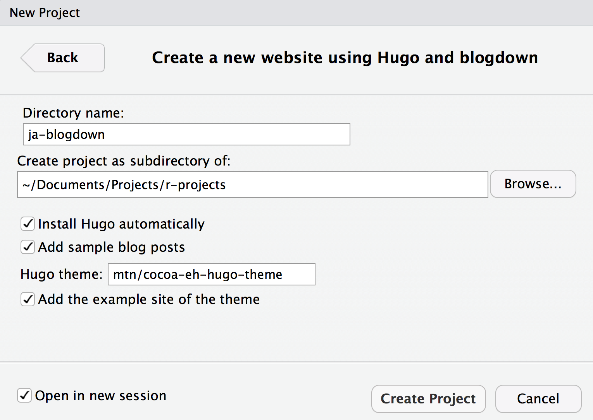
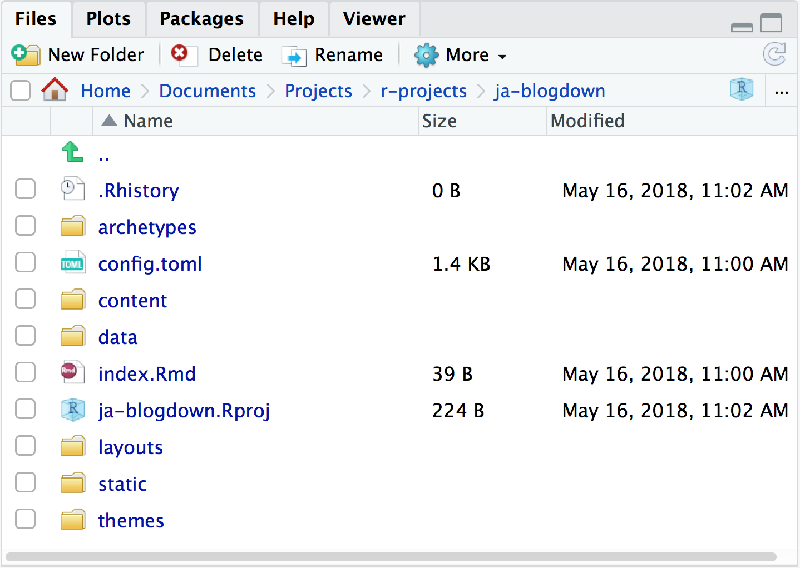
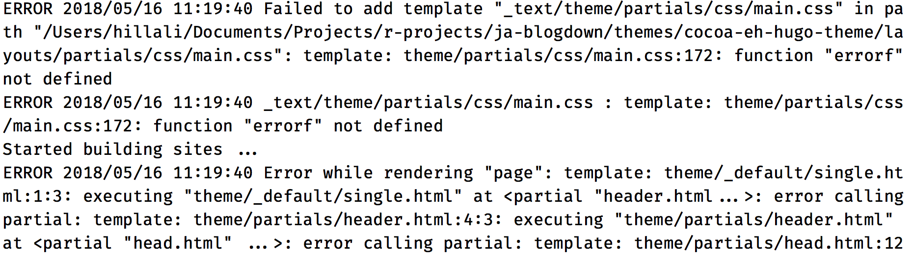
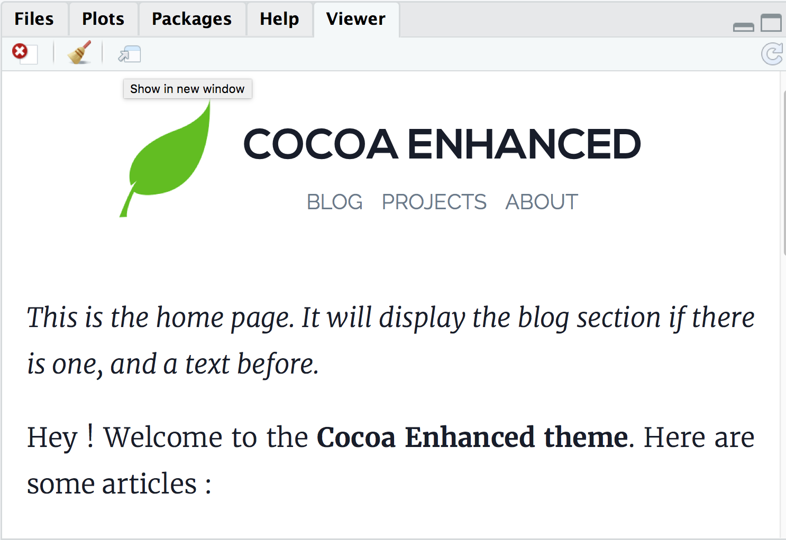

```{r setup, include=FALSE}
options(htmltools.dir.version = FALSE)
knitr::opts_chunk$set(warning = FALSE, message = FALSE, 
  comment = NA, dpi = 300,
  fig.align = "center", out.width = "80%", cache = FALSE)
library(tidyverse)
library(here)
library(knitr)
```


class: center, middle, inverse

# First:

## Slides with `xaringan`

--

# NOW!:

## Sites with `blogdown`

---
background-image: url("https://media.giphy.com/media/3o6ozfM60Gc64dN0A0/giphy.gif")
background-size: cover


---
# In RStudio

File ➡️ New Project ➡️ New Directory ➡️ Website using blogdown

```{r echo = FALSE}
include_graphics("../images/website-using-blogdown.png")
```

---
# Next in RStudio

```{r echo = FALSE}

```

---
# Open your new project

```{r echo = FALSE}

```

---
# Mini-orientation to Hugo

https://gohugo.io/getting-started/directory-structure/


```{r eval = FALSE}
.
├── archetypes
├── config.toml
├── content
├── data
├── layouts
├── static
└── themes
```

---
# Overriding vs editing

https://gohugo.io/themes/customizing/

> *When you use a theme cloned from its git repository, do not edit the theme’s files directly. Instead, theme customization in Hugo is a matter of overriding the templates made available to you in a theme. This provides the added flexibility of tweaking a theme to meet your needs while staying current with a theme’s upstream.*

--

Note which folders are *empty* at the top level of your project:

```{r eval = FALSE}
.
├── archetypes #<<
├── config.toml
├── content
├── data #<<
├── layouts #<<
├── static
└── themes
```

---
class: middle, inverse, center
## Editing the configuration file

---
# Open `config.toml`

- TOML is like YAML, but not 😂

- Set `baseurl = "/"`

- Add `ignoreFiles = ["\\.Rmd$", "\\.Rmarkdown$", "_files$", "_cache$"]`

```{r eval = FALSE}
baseurl = "/" #<<
theme = "cocoa-eh-hugo-theme"
builddrafts = true
canonifyurls = true
contentdir = "content"
languageCode = "en-US"
layoutdir = "layouts"
publishdir = "public"
author = "Joel Adams" #<<
title = "Joel Adams" #<<
disqusshortname = ""
pluralizelisttitles = false
ignoreFiles = ["\\.Rmd$", "\\.Rmarkdown$", "_files$", "_cache$"] #<<
```

---
# Serve site!

Mouse up to "Addins"


--

```{r echo = FALSE}

```


---
# I can fix this!

- Mouse over to "themes" folder, then click on that folder

- Click through to `/layouts/partials/css/main.css`

- Search for `errorf` (about line 170)

- Make it look like this:

```
  text-transform: {{ .Site.Params.titlestyle }};
      {{ end }}
  {{ else }}
  text-transform: uppercase;
  {{ end }}
```

- Try serving the site again

---
# Almost there!


```{r echo = FALSE}

```

---
# Go back to `config.toml`


```{r eval = FALSE}
baseurl = "/" #<<
theme = "cocoa-eh-hugo-theme"
builddrafts = true
canonifyurls = true
contentdir = "content"
languageCode = "en-US"
layoutdir = "layouts"
publishdir = "public"
author = "Joel Adams" #<<
title = "Joel Adams" #<<
disqusshortname = ""
pluralizelisttitles = false
ignoreFiles = ["\\.Rmd$", "\\.Rmarkdown$", "_files$", "_cache$"] #<<
enableEmoji = true #<<
```

---
# Update logo

Mouse over the `static/img/` and see `logo.png`? We can replace that file, or make new file.

```{r eval = FALSE}
[permalinks]
blog = "blog/:slug/"

[params]
dateform = "Jan 2, 2006"
dateformfull = "Mon Jan 2 2006 15:04:05 MST"
description = "Professional website" #<<
copyright = "Copyright © 2015 Joel Adams" #<<
copyrightUrl = "https://creativecommons.org/licenses/by-sa/4.0/" #<<
logofile = "img/joel.jpg" #<<
faviconfile = "img/logo.png"
highlightjs = true
progressively = true
share = true
```

---
# Edit content 

Mouse to `content/` and edit `about.md` and `home.md`
---
# Theme examples

- [Julia Silge](https://juliasilge.com)

- [Joshua Rosenberg](https://jrosen48.github.io)

---
# Blogdown resources

- [Blogdown demo site](https://blogdown-demo.rbind.io)
- [Blogdown book](https://bookdown.org/yihui/blogdown/)
- [I did a blog post on it](https://alison.rbind.io/post/up-and-running-with-blogdown/)
- [Also did a workshop](https://alison.rbind.io/talk/blogdown-meetup/)
- [Yihui's slides from RStudio Conf](https://slides.yihui.name/2018-blogdown-rstudio-conf-Yihui-Xie.html)

---
# Next up!

We'll connect to GitHub and deploy to Netlify.

---
# What is hard about `blogdown`?

Lots

---
# My growing list

- TOML in `config` file, but YAML in posts
- Themes vary a lot
- Overriding versus editing directory structure