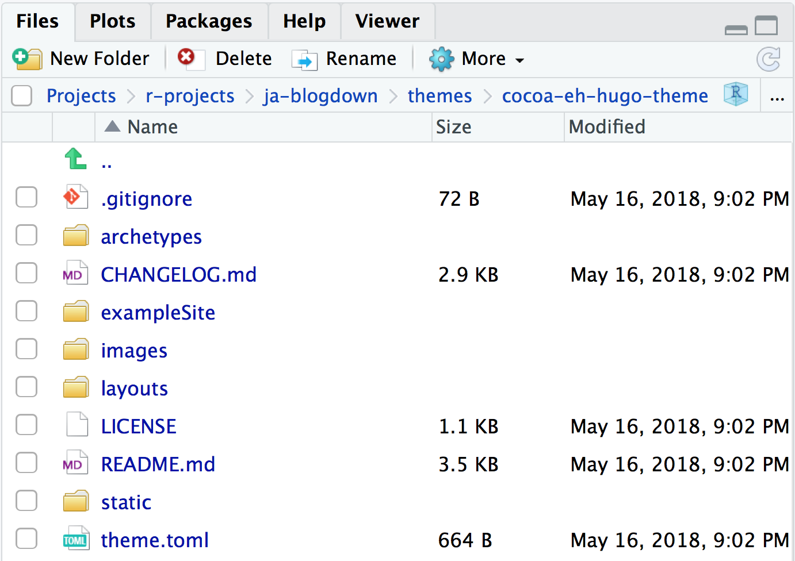
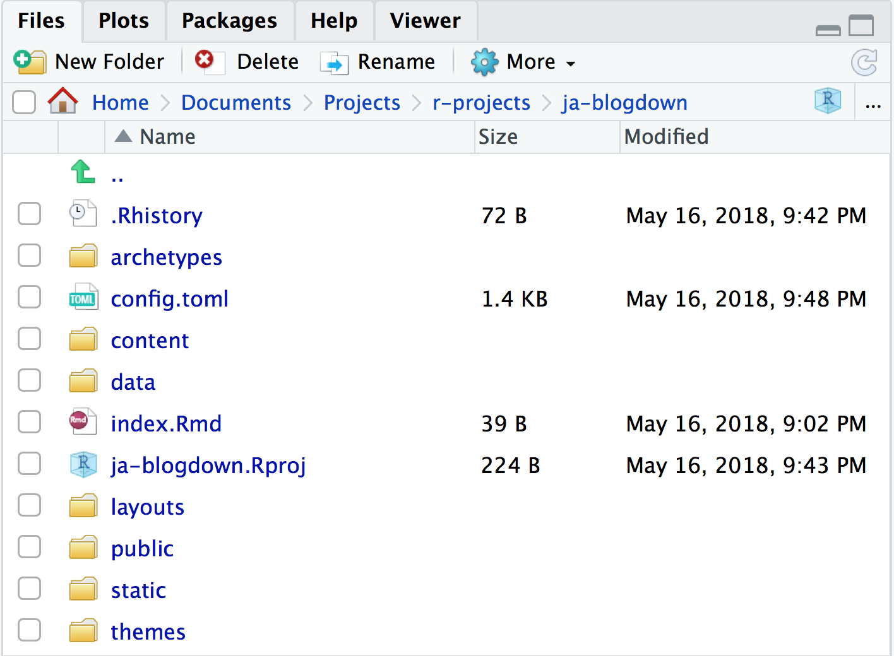

```{r setup, include=FALSE}
options(htmltools.dir.version = FALSE)
knitr::opts_chunk$set(warning = FALSE, message = FALSE, 
  comment = NA, dpi = 300,
  fig.align = "center", out.width = "80%", cache = FALSE)
library(tidyverse)
library(here)
library(knitr)
```


class: center, middle, inverse

# First:

## Slides with `xaringan`

--

# NOW!:

## Sites with `blogdown`

---
background-image: url("https://media.giphy.com/media/3o6ozfM60Gc64dN0A0/giphy.gif")
background-size: cover

---
class: middle, center


---

## So what is blogdown?<sup>*</sup>


- [R Markdown](https://rmarkdown.rstudio.com) 

    - (relatively) simple syntax for writing documents
    
    - the simpler, the more portable (multiple output formats)
    
    - not only convenient (maintenance), but also reproducible
    
    - most features of R Markdown _and_ [**bookdown**](https://bookdown.org) (technical writing)!!

- [Hugo](https://gohugo.io) 

    - free, open-source, and easy to install (a single binary)
    
    - lightning fast (generates one page in one millisecond)
    
    - general-purpose (not only for blogs)

.footnote[
[\*] From Yihui: https://slides.yihui.name/2017-rmarkdown-UNL-Yihui-Xie.html#35.
]

???

Pandoc's Markdown: paragraphs, section headings, (un)numbered lists, blockquotes, math expressions, tables, images, footnotes, bibliography/citations, ...

See Chapter 2 of the **bookdown** book for additional Markdown features, such as figure/table captions, cross-references, numbered equations, theorems, ...


---

## Why not WordPress, Tumblr, Medium.com, Blogger.com, etc?<sup>*</sup>

- No R Markdown support (even math support is often nonexistent or awkward)

- Huge benefits of static websites compared to dynamic websites

    - all static files, no PHP or databases, no login/password, work everywhere (even offline)
    
    - typically fast to visit (no computation needed on the server side), and easy to speed up via CDN

.footnote[
[\*] From Yihui: https://slides.yihui.name/2017-rmarkdown-UNL-Yihui-Xie.html#36.
]

???

If all you want to write about is what you had for breakfast today, or how cute your kittens are, there is no need to use blogdown. If there is anything related to R, statistical computing, and/or graphics, blogdown will be much more convenient.

---
class:middle, center, inverse


---
# In RStudio

File ➡️ New Project ➡️ New Directory ➡️ Website using blogdown

```{r echo = FALSE}
include_graphics("../images/website-using-blogdown.png")
```

---
# Next in RStudio

```{r echo = FALSE}
include_graphics("../images/install-cocoa-eh-theme.png")
```

---
# Open your new project

```{r echo = FALSE}
include_graphics("../images/hugo-initial-files.png")
```

---
# Mini-orientation to Hugo

https://gohugo.io/getting-started/directory-structure/


```{r eval = FALSE}
.
├── .Rhistory 
├── archetypes
├── config.toml
├── content
├── data
├── index.Rmd
├── your .Rproj file
├── layouts
├── static
└── themes
```

---
# Overriding vs editing

https://gohugo.io/themes/customizing/

> *When you use a theme cloned from its git repository, do not edit the theme’s files directly. Instead, theme customization in Hugo is a matter of overriding the templates made available to you in a theme. This provides the added flexibility of tweaking a theme to meet your needs while staying current with a theme’s upstream.*

--

Note which folders are *empty* at the top level of your project:

```{r eval = FALSE}
.
├── .Rhistory 
├── archetypes #<<
├── config.toml
├── content
├── data #<<
├── index.Rmd
├── your .Rproj file
├── layouts #<<
├── static
└── themes
```

---
# Open themes

Look in `/themes/cocoa-eh-hugo-theme/`. Notice now the folder structure here *mirrors* your Hugo directory structure.

```{r echo = FALSE}

```

---
# Override...

.pull-left[
your theme directory...
```{r eval = FALSE}
.
├── archetypes #<<
├── exampleSite
├── images
├── layouts #<<
└── static #<<
```
]

.pull-right[
with your root project directory.
```{r eval = FALSE}
.
├── .Rhistory 
├── archetypes #<<
├── config.toml
├── content
├── data 
├── index.Rmd
├── your .Rproj file
├── layouts #<<
├── static #<<
└── themes
```
]


---
class: middle, inverse, center

# 🏡
## Edit the configuration file

---
# Open `config.toml`

- TOML is like YAML, but not 😂

- Set `baseurl = "/"`

- Add `ignoreFiles = ["\\.Rmd$", "\\.Rmarkdown$", "_files$", "_cache$"]`

```{r eval = FALSE}
baseurl = "/" #<<
theme = "cocoa-eh-hugo-theme"
builddrafts = true
canonifyurls = true
contentdir = "content"
languageCode = "en-US"
layoutdir = "layouts"
publishdir = "public"
author = "Joel Adams" #<<
title = "Joel Adams" #<<
disqusshortname = ""
pluralizelisttitles = false
ignoreFiles = ["\\.Rmd$", "\\.Rmarkdown$", "_files$", "_cache$"] #<<
```

---
class: center, inverse, middle
# Serve site!

Mouse up to "Addins" ➡️ "Serve site"


---
# Success?


```{r echo = FALSE}
include_graphics("../images/cocoa-in-viewer.png")
```

---
## Go back to your project root directory

*New*: the `public` folder

```{r out.width='75%', echo = FALSE}

```


---
# Go back to `config.toml`


```{r eval = FALSE}
baseurl = "/" 
theme = "cocoa-eh-hugo-theme"
builddrafts = true
canonifyurls = true
contentdir = "content"
languageCode = "en-US"
layoutdir = "layouts"
publishdir = "public"
author = "Joel Adams" 
title = "Joel Adams" 
disqusshortname = ""
pluralizelisttitles = false
ignoreFiles = ["\\.Rmd$", "\\.Rmarkdown$", "_files$", "_cache$"] 
enableEmoji = true #<<
```

---
# Update logo

Mouse over the `static/img/` and see `logo.png`? We can replace that file, or make new file.

```{r eval = FALSE}
[permalinks]
blog = "blog/:slug/"

[params]
dateform = "Jan 2, 2006"
dateformfull = "Mon Jan 2 2006 15:04:05 MST"
description = "Professional website" #<<
copyright = "Copyright © 2015 Joel Adams" #<<
copyrightUrl = "https://creativecommons.org/licenses/by-sa/4.0/" #<<
logofile = "img/joel.jpg" #<<
faviconfile = "img/logo.png"
highlightjs = true
progressively = true
share = true
```

---
# Edit content 

Mouse to `content/` and:

- Edit your `about.md`
  - Example 1: [Julia Silge](https://juliasilge.com/about/)
  - Example 2: [Kara Woo](https://karawoo.com)
  - Example 3 (a bit longer): [David Robinson](http://varianceexplained.org/about/)
  - Example 4: [Emily Robinson](http://hookedondata.org/about/)
  - Example 5: [Yihui Xie](https://yihui.name/en/about/)
  - Example 6: [Chester Ismay](http://chester.rbind.io/about/)

--

- Edit your `home.md`
  - We'll make this your new landing page, so imagine this is what people will initially see when they visit your site.
      - Example 1: [Hadley Wickham](http://hadley.nz)
      - Example 2: [Sam Tyner](https://sctyner.github.io)

---
class: inverse, middle, center

## Take 5 minutes to edit your content


---
# Let's override the home page

- Index is default landing page for Hugo

--

- Look in your theme's layouts directory (`/themes/cocoa-eh-hugo-theme/layouts`).
  - Open `index.html`- this is the layout for your current home page.

--

- Make a *copy* of this file.

--

- Put the *copy* in the analogous project root directory: `/layouts/`

---
# Edit the `index.html` *copy*

- Edit the version in `/layouts/`
  - *not* `/themes/cocoa-eh-hugo-theme/layouts`
  
--

- We'll remove the latest posts and best posts sections:

--

```
{{ partial "header.html" . }}
<div class="main column">
    <div class="container">
        <div class="content">
            {{ range where .Data.Pages "Title" "Home" }}
                <div class="markdown">
                {{ .Content }}
                </div>
            {{ end }}
        </div>
    </div>
</div>
{{ partial "footer.html" . }}
```
---
# Workflow<sup>*</sup>


- Open your website project, click the "Serve Site" addin
    
- Revise old pages/posts, or click the "New Post" addin
    
- Write and save (take a look at the automatic preview)
    
- Push everything to Github

.footnote[
[\*] From Yihui: https://slides.yihui.name/2017-rmarkdown-UNL-Yihui-Xie.html#30.
]

---
# Theme examples

- [Julia Silge](https://juliasilge.com)

- [Joshua Rosenberg](https://jrosen48.github.io)

---
# Blogdown resources

- [Blogdown demo site](https://blogdown-demo.rbind.io)
- [Blogdown book](https://bookdown.org/yihui/blogdown/)
- [I did a blog post on it](https://alison.rbind.io/post/up-and-running-with-blogdown/)
- [Also did a workshop](https://alison.rbind.io/talk/blogdown-meetup/)
- [Yihui's slides from RStudio Conf](https://slides.yihui.name/2018-blogdown-rstudio-conf-Yihui-Xie.html)

---
# Next up!

We'll connect to GitHub and deploy to Netlify.

---
# What is hard about `blogdown`?

- TOML in `config` file, but YAML in posts
- Themes vary a lot
- Overriding versus editing directory structure