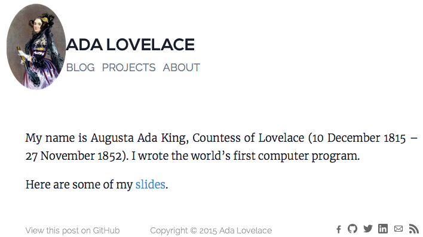
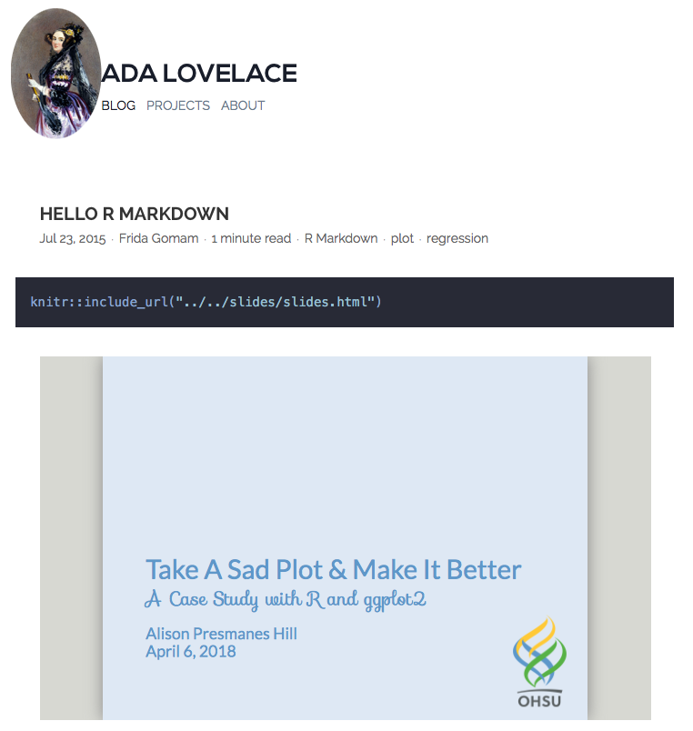
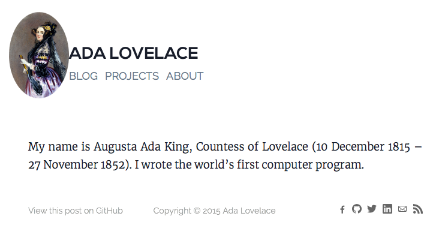

```{r setup, include=FALSE}
options(htmltools.dir.version = FALSE)
knitr::opts_chunk$set(warning = FALSE, message = FALSE, 
  comment = NA, dpi = 300,
  fig.align = "center", out.width = "80%", cache = FALSE)
library(tidyverse)
library(here)
library(knitr)
```


class: center, middle, inverse

# First:

## Build a site with `blogdown`

--

# Pre-work:

## Push to GitHub

--

# NOW!:

## Deploy to Netlify!

---
class: center, middle

# Your pre-work


http://happygitwithr.com

---
class: inverse, middle, center

> "As we just mentioned, Netlify allows you to quickly publish a website by uploading the `public/` folder through its web interface, and you will be assigned a random subdomain `*.netlify.com`. This approach is good for those websites that are not updated frequently (or at all)."

https://bookdown.org/yihui/blogdown/netlify.html

---
# If you didn't do the pre-work...

- Drag + drop your `public/` folder.

- If you did, follow me!

---
class: inverse, middle, center
## Go to Netlify.com

http://netlify.com

---
class: inverse, middle, center
## Click on "Sign up"

```{r echo = FALSE}
include_graphics("../images/netlify-landing.png")
```

---
class: inverse, middle, center
## Select "GitHub"

click to "Authorize Netlify"


```{r echo = FALSE}
include_graphics("../images/netlify-sign-up.png")
```

Recommended: go through the quick start guide
---
## Netlify review so far

1. Sign up
1. Pick GitHub
1. Authorize Netlify
1. Go through the quick start guide

---
class: inverse, middle, center
# Two ways to make a new site

```{r echo = FALSE}
include_graphics("../images/netlify-new-site.png")
```

---
# New site 

If you did the pre-work
- Select "New site from Git"
- Under continuous deployment, pick GitHub
```{r echo = FALSE}
include_graphics("../images/netlify-new-git-site.png")
```
---
# New site from Git

- Click to authorize Netlify
- Confirm GitHub password
- Pick your blogdown repository

```{r echo = FALSE}
include_graphics("../images/netlify-pick-git-repo.png")
```


---
# Build options

1. Leave branch to deploy as master
1. The **build command** is `hugo`
1. The **publish directory** is `public`

```{r echo = FALSE, out.width='60%'}
include_graphics("../images/netlify-basic-build.png")
```

---
# Go back to your R project

In R console type:
```{r}
blogdown::hugo_version()
```

---
# Go back to Netlify in browser


1. Click `show advanced`
1. Create a `new variable`: 
    - the key is `HUGO_VERSION`
    - the value is `0.40` 
1. Click deploy site
```{r echo = FALSE, out.width='80%'}
include_graphics("../images/netlify-adv-build.png")
```

---
class: inverse, middle, center

```{r echo = FALSE, out.width='80%'}
include_graphics("../images/netlify-first-deploy.png")
```
---
# From Netlify

- Click on Site Settings (from overview) --> general

- Click on change site name and try to find a unique one- it will change your domain name to `[your-new-site-name].netlify.com`

```{r echo = FALSE, out.width='80%'}
include_graphics("../images/netlify-change-site-name.png")
```

---
# Go back to your R project

- Open up `config.toml` and update your `baseurl = "https://[your-new-site-name].netlify.com/"`
    - The final `/` is critical!

- Save

- *Serve your site (if you haven't done this already!)*

- Commit

- Push to GitHub

---
class: middle, inverse, center
# Now go to your site!


---
## Add your `xaringan` slides

https://blogdown-demo.rbind.io/2017/09/06/adding-r-markdown-documents-of-other-output-formats/

1. Go to your blogdown project’s root directory and create a new folder called `R`
1. In that `R/` directory, create a new R script called `build.R` that contains 1 line of code that reads: `blogdown::build_dir('static')`
1. Add and save Rmd file(s) to your blogdown project in a new `static/slides/` directory.
1. *Serve your site (if you haven't done this already!)*

```{r echo = FALSE, out.width='50%'}
include_graphics("../images/build-R-directory.png")
```

---
## Link to your slides

Now that your `xaringan` slides are being rendered by `blogdown`, we have to link to them! If you placed them in `static/slides/`, then you should be able to navigate to the rendered slides at:

- `[your-new-site-name].netlify.com/slides/[name_of_deck].html`

But you can use **relative** links in your `blogdown` site using Markdown links:

- `Here are some of my [slides](slides/slides.html)`

`blogdown` assumes that relative links start in the `static/` directory.

---
## Add link to `home.md`

I added a Markdown link to my `/content/home.md` using this line:

- `Here are some of my [slides](slides/slides.html)`

```{r echo = FALSE}

```

---
class: inverse, middle, center

# ⚠️

## Going further...

You have gone far enough- you don't *have* to do what is next!

---
## Embed slides within an .Rmd post

You can embed your `xaringan` slides within an .Rmd blog post. Steps:

- Go to `content/blog/2015-07-23-r-rmarkdown.Rmd` (this is just the sample blog post)

- Add an R code chunk and use `knitr::include_url`

```{r eval = FALSE}
knitr::include_url("../../slides/slides.html")
```

- Why this particular file path? Because `knitr` uses the starting directory as where your post lives, so `content/blog/`.
    - The second `../` gets you up one directory, to `content/`
    - The first `../` gets you up one more directory level, to your project root directory

---
## View embedded slides

```{r echo = FALSE, out.width='65%'}

```

---
class: center, middle
## Demo to override CSS

```{r echo = FALSE}

```

---
## Override CSS to make round logo

1. Make a new `static/css/` directory
1. Make a new text file in that directory, I called mine `circle.css` and put this inside

```{r eval = FALSE}
div.header .container .logo {
  max-width: 100px;
  margin-left: -2em;
  border-radius: 50%; #<< 
}
```

---
## Demo to override CSS

Go back to the `config.toml`

```{r eval = FALSE}
[params]
dateform = "Jan 2, 2006"
dateformfull = "Mon Jan 2 2006 15:04:05 MST"
description = "Example blog"
copyright = "Copyright © 2015 Ada Lovelace"
# copyrightUrl = "https://creativecommons.org/licenses/by-sa/4.0/"
logofile = "img/logo.jpg"
faviconfile = "img/logo.png"
highlightjs = true
progressively = true
share = true
extracssfiles = [ "/css/circle.css" ] #<<  
```

---
## Override CSS

How did I know to do this? A lot of googling. I finally found an example `config.toml` for the parent theme, Cocoa, here:

- https://github.com/nishanths/cocoa-hugo-theme/blob/master/exampleSite/config.toml
