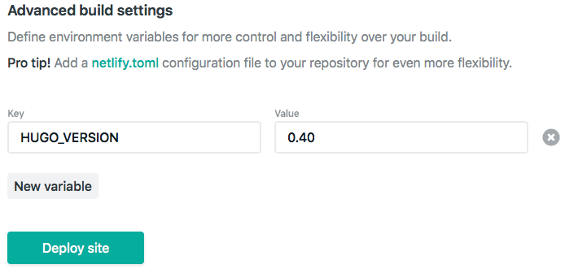

```{r setup, include=FALSE}
options(htmltools.dir.version = FALSE)
knitr::opts_chunk$set(warning = FALSE, message = FALSE, 
  comment = NA, dpi = 300,
  fig.align = "center", out.width = "80%", cache = FALSE)
library(tidyverse)
library(here)
library(knitr)
```


class: center, middle, inverse

# First:

## Build a site with `blogdown`

--

# NOW!:

## Deploy to Netlify!

---
class: inverse, middle

## I am assuming...

✅ You have a [GitHub.com](https://github.com) account (sign up for a free account: https://github.com/join)

--

✅  You have a folder on your computer for your `R project` (you should see an `*.Rproj` file in there)

--

✅  In that folder, you have built a site using `blogdown` (and you have used the `Serve Site` add-in!)

--

✅  You want to share your site now with another human   📢 

---
class: inverse, middle, center
# 📢 
## Go to Netlify.com

http://netlify.com

---
class: inverse, middle, center
## Click on "Sign up"

```{r echo = FALSE}
include_graphics("../images/netlify-landing.png")
```

---
class: inverse, middle, center
## Select "GitHub"

Click to "Authorize Netlify"


```{r echo = FALSE}
include_graphics("../images/netlify-sign-up.png")
```

Recommended: go through the quick start guide
---
## Netlify review so far

1. Sign up
1. Pick GitHub 
1. Authorize Netlify
1. Go through the quick start guide

--

Are we all there?

---
class: inverse, middle, center
# Two ways to make a new site

```{r echo = FALSE}
include_graphics("../images/netlify-new-site.png")
```

---
class: inverse, middle, center

#📢 
## Way 1:
## Drag & Drop to Netlify

---
class: inverse, middle, center

> "Netlify allows you to quickly publish a website by uploading the `public/` folder through its web interface, and you will be assigned a random subdomain `*.netlify.com`. This approach is good for those websites that are not updated frequently (or at all)."

https://bookdown.org/yihui/blogdown/netlify.html

---
class: inverse
background-image: url("../images/blogdown-lifecycle-01.png")
background-size: contain

---
class: inverse
background-image: url("../images/blogdown-lifecycle-02.png")
background-size: contain

---
class: inverse
background-image: url("../images/blogdown-lifecycle-03.png")
background-size: contain

---
class: inverse
background-image: url("../images/blogdown-lifecycle-04.png")
background-size: contain


---
class: inverse
background-image: url("../images/blogdown-lifecycle-05.png")
background-size: contain


---
class: inverse
background-image: url("../images/blogdown-lifecycle-06.png")
background-size: contain

---
class: inverse, middle, center

# 📢 
## Way 2:
## Push to GitHub ➡️
## Build + Deploy with Netlify

---
class: inverse, middle, center

> "[The previous] approach is good for those websites that are not updated frequently (or at all). However, it is unlikely that you will not need to update your website, so we introduce a better approach in this section, which will take you a few more minutes to complete the configurations. Once it is properly configured, all you need to do in the future is to update the source repository, and Netlify will call Hugo to render your website automatically."

https://bookdown.org/yihui/blogdown/netlify.html

---
class: inverse, middle

## Push `PAUSE` right here!


- Have you used Git within RStudio before?

--

- Have you ever connected a GitHub repository to an `R Project` before?

--

- Have you ever "pushed" an `R project` to a GitHub repository?

--

- If the above questions strike fear in your ❤️, please do the work on the next slide until you get to the happy parrots. 
  - If you are confident that you have used Git within RStudio before, skip ahead to enjoy the happy parrots.


---
class: center, middle
# [Happy Git with R](http://happygitwithr.com)


This slide deck will walk you through the [online book](http://happygitwithr.com):
https://apreshill.github.io/data-vis-labs-2018/slides/07-prework-slides_blogdown.html#1

---
class: inverse, middle, center

## Onward!


---
## Using version control with `blogdown`

Recommend that you add the last lines to your `.gitignore` file **now** (the others *should* already be there if you are working from an `R Project`):

```{r eval = FALSE}
.Rproj.user
.Rhistory
.RData
.Ruserdata
blogdown #<<
.DS_Store # if a windows user, Thumbs.db instead #<<
public/ # if using Netlify #<<
```

https://bookdown.org/yihui/blogdown/version-control.html

---
# New site 


- Select "New site from Git"
- Under continuous deployment, pick GitHub
```{r echo = FALSE}
include_graphics("../images/netlify-new-git-site.png")
```
---
# New site from Git

- Click to authorize Netlify
- Confirm GitHub password
- Pick the repository for the R project with your `blogdown` site in it

```{r echo = FALSE}
include_graphics("../images/netlify-pick-git-repo.png")
```


---
class: inverse
background-image: url("../images/blogdown-lifecycle-07.png")
background-size: contain


---
class: inverse
background-image: url("../images/blogdown-lifecycle-08.png")
background-size: contain


---
class: inverse
background-image: url("../images/blogdown-lifecycle-09.png")
background-size: contain

---
class: inverse
background-image: url("../images/blogdown-lifecycle-10.png")
background-size: contain

---
# Build options

1. Leave branch to deploy as `master`
1. The **build command** is `hugo`
1. The **publish directory** is `public`

```{r echo = FALSE, out.width='60%'}
include_graphics("../images/netlify-basic-build.png")
```

---
# Go back to your R project

In R console type:
```{r}
blogdown::hugo_version()
```

---
# Go back to Netlify in browser


1. Click `show advanced`
1. Create a `new variable`: 
    - the key is `HUGO_VERSION`
    - the value *must be* typed like this: `0.41` (I suggest using the same version as your local build to minimize frustration)
1. Click `Deploy site`
```{r echo = FALSE, out.width='80%'}

```


---
class:inverse, middle, center

## All together now!


---
# On Netlify

We all have a site currently deployed on Netlify!

--

The random domain names are fun, but links like [https://compassionate-bardeen-f2e898.netlify.com](https://compassionate-bardeen-f2e898.netlify.com)  and [https://jolly-mestorf-343119.netlify.com](https://jolly-mestorf-343119.netlify.com) aren't easy to remember, much less share! 

---
# On Netlify

- Click on Site Settings (from overview) --> general

- Click on `change site name` and try to claim a unique one- it will change your domain name to `[your-new-site-name].netlify.com`

```{r echo = FALSE, out.width='80%'}
include_graphics("../images/netlify-change-site-name.png")
```

---
# Go back to your R project

- Open up `config.toml` and update your `baseurl = "https://[your-new-site-name].netlify.com/"`
    - The final `/` is critical!

- Save

- *Serve your site (if you haven't done this already!)*

---
# Way 1 (the draggers + droppers)

- Go back to Netlify.com, click on `Deploys`, and drag and drop your *new* `public/` folder (don't create a new site!)

```{r echo = FALSE, out.width='80%'}
include_graphics("../images/netlify-manual-update.png")
```

---
# Way 2 (the pushers)

- Commit

- Push to GitHub

- Reap the benefits of Way 2 😉

---
class: middle, inverse, center
## Now go to your site!

