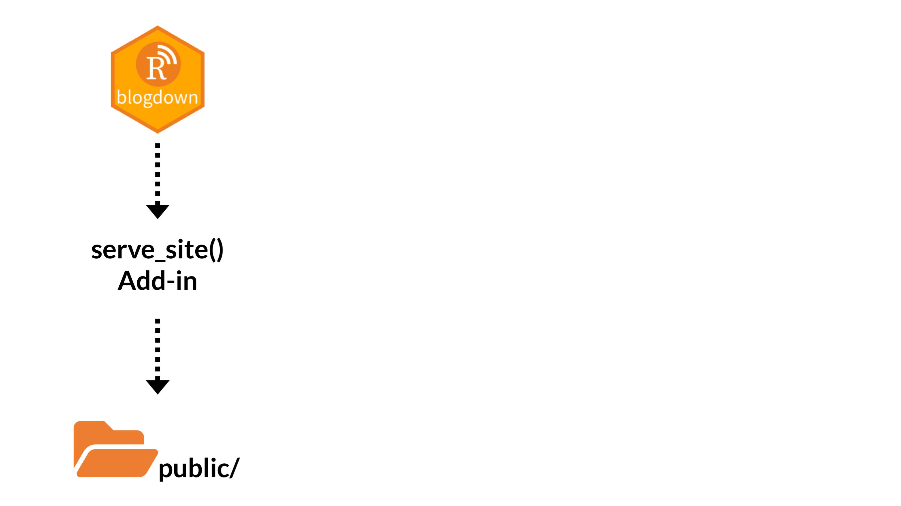
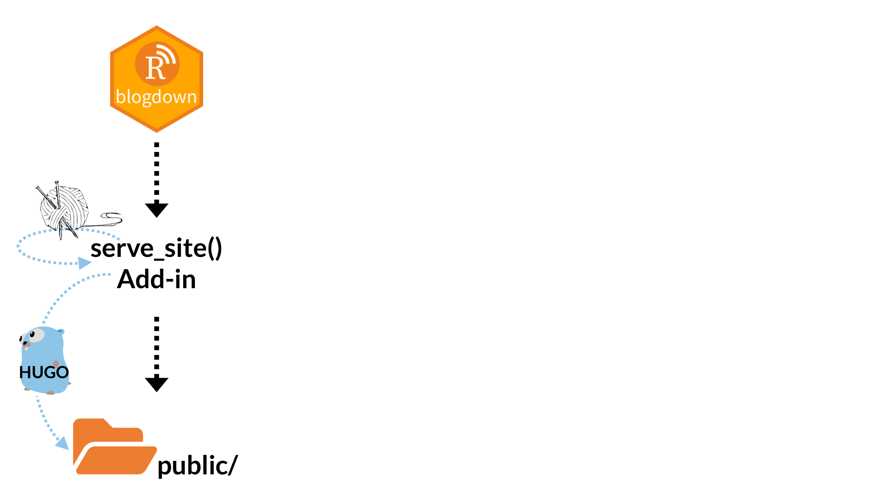
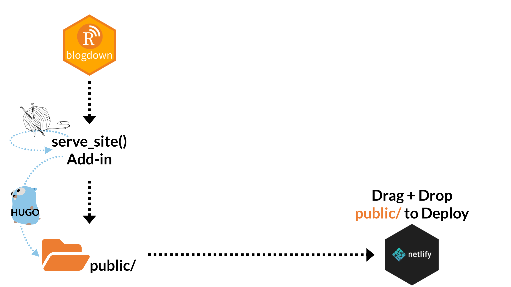
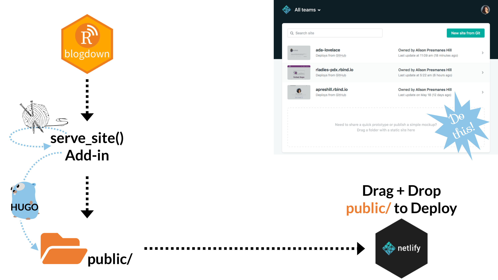
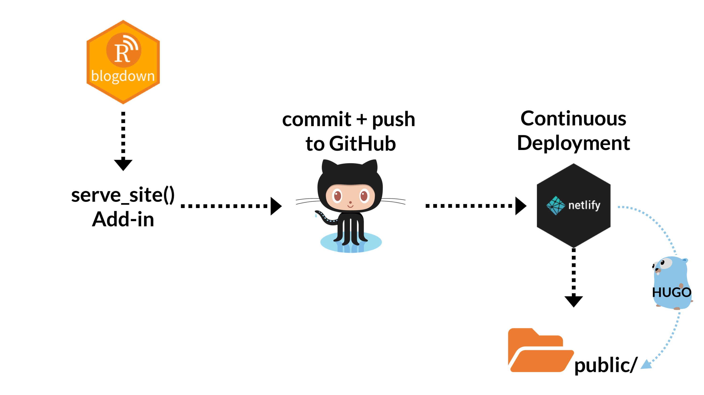
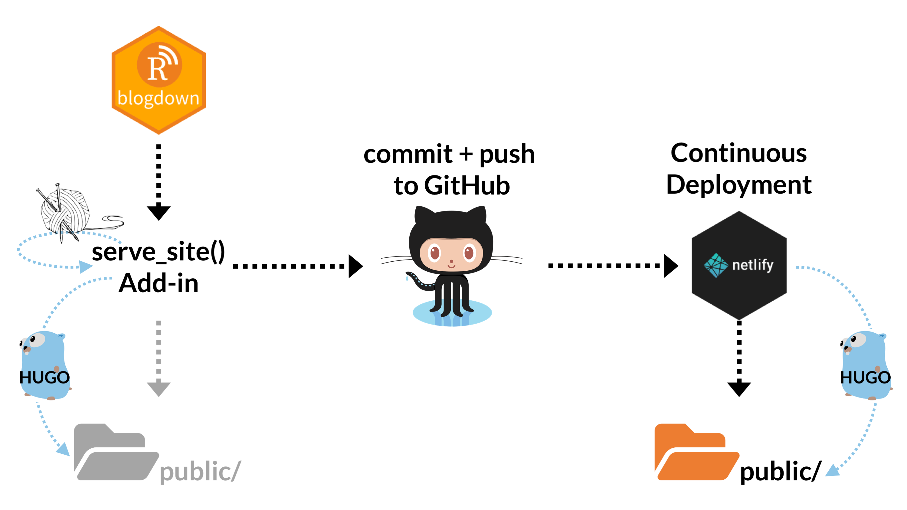
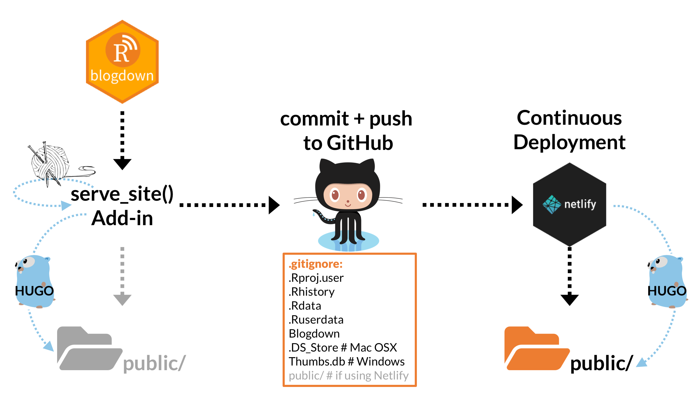

```{r setup, include=FALSE}
options(htmltools.dir.version = FALSE)
knitr::opts_chunk$set(warning = FALSE, message = FALSE, 
  comment = NA, dpi = 300,
  fig.align = "center", out.width = "200%", cache = FALSE)
library(tidyverse)
library(here)
library(knitr)
```


```{r echo = FALSE}

```

---

```{r echo = FALSE}

```

---
```{r echo = FALSE}

```

---
```{r echo = FALSE}

```

---
```{r echo = FALSE}

```

---
```{r echo = FALSE}

```

---
```{r echo = FALSE}

```

---
# Data Cleaning in R

So many great packages!

- [`janitor`](https://github.com/sfirke/janitor)
    - [Vignette 1](https://cran.r-project.org/web/packages/janitor/vignettes/janitor.html), [Vignette 2](https://cran.r-project.org/web/packages/janitor/vignettes/tabyls.html)
    - Most used functions: `clean_names()` + `tabyl()`
      - Don't miss the `tabyl()` adornments!
- Importing data
    - [`readxl`](https://readxl.tidyverse.org)
    - [`haven`](http://haven.tidyverse.org)
- [`visdat`](http://visdat.njtierney.com)
- [`naniar`](http://naniar.njtierney.com)
- [`lubridate`](https://lubridate.tidyverse.org)
- [`stringr`](https://stringr.tidyverse.org)
